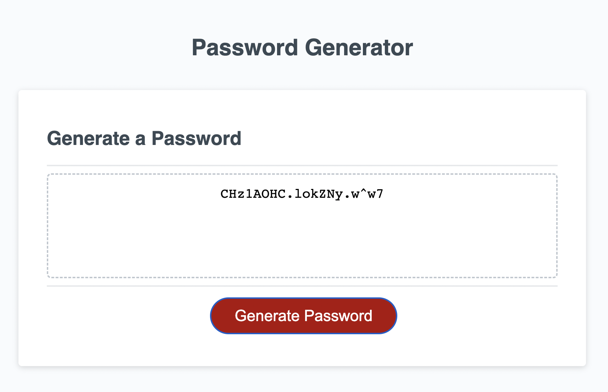

# 03-Password-Generator

## Deployed URL: https://josephehayes.github.io/03-Password-Generator/

## Description
This page will generate a password based on user input. 

Once Generate Password is selected, a series of prompts will appear to determine the criteria for the password.

The password length must be between 8 and 128 characters. If anything below 8 or above 128 characters is entered, an error will be produced.

The characters used for the password can be any of the following:

* Uppercase: ABCDEFGHIJKLMNOPQRSTUVWXYZ
* Lowercase: abcdefghijklmnopqrstuvwxyz
* Numeric: 1234567890
* Special: !#$%&()*+,-./:;<=>?@[\]^_`{|}~

When the character types have been determined, the page will generate a randomized password using the criteria selected, and display it to the page.

## Screenshot

